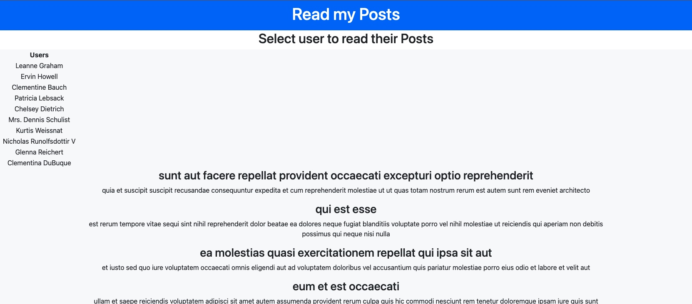

# user-search-challenge

## Description

Application to display posts created by specific users. This application uses JSONPlaceholder API services.

### Live Link

https://zestylimones.github.io/user-search-challenge/

## Table of Contents

- [Visual Example](#visual-example)
- [Tech Used](#tech-used)
- [Licenese](#license)

## Visual Exampes

  
(<a href="#top">back to top</a>)

## Tech Used

  

(<a href="#top">back to top</a>)

## License

MIT

(<a href="#top">back to top</a>)

